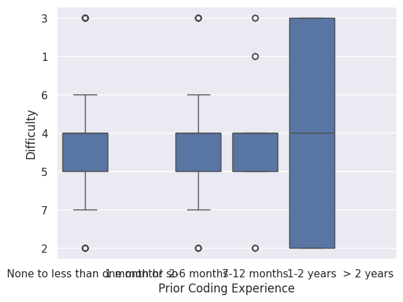
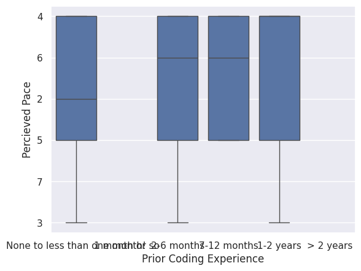
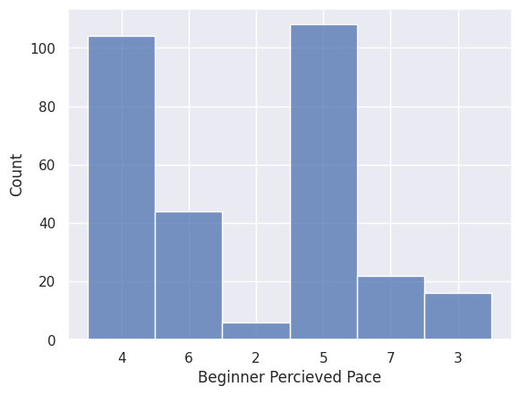
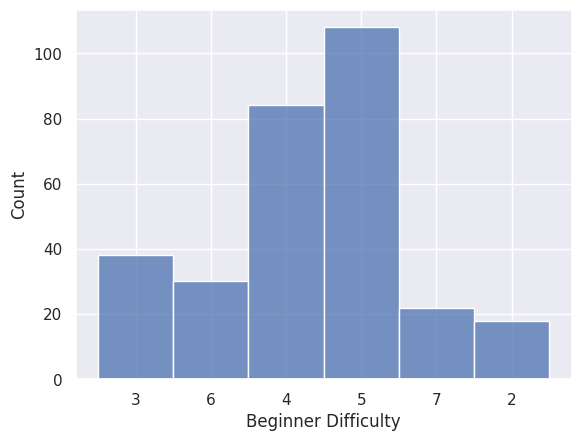

---
# Do not edit the text between these lines!
layout: default
---

# Sonya Ramaraju EX09 Assignment

<!-- This is a comment. Below, you'll see code for inserting an image. To make this image appear, update <custom-path>. To add an image, save it inside the imgs folder of this repository. -->

## Beginner coders' percieved pace and difficulty of COMP110

The data analysis suggests that prior coding experience is associated with students' perceptions of both difficulty and pace in COMP110. Students with little to no programming experience tend to report higher levels of difficulty and percieve the pace as faster compared to students with more experience. However, there is still overlap between groups, showing that experience alone cannot fully determine how students see the course.
Based on these results, I would recommend considering adjustments to pace or additional support for students with little prior programming experience. This could include optional prerequisate materials or more guided practice/assignments. The data suggests that these students are more likely to struggle with both difficulty and pace, so more targeted resources could improve their experience.
Implementing these changes could come with trade-offs. Providing additional resources or restructuring earlier content may require more instruction and time from the COMP110 team. It could also slow the pace for more experienced students if assignments are too guided. Those students could also feel less challenged in this case as well.
Further extensions of this analysis could include factors like hours spent on assignments or past computer science class experience to better explain differences in percieved difficulty or pace. Collecting data across a longer period of time could also improve findings.